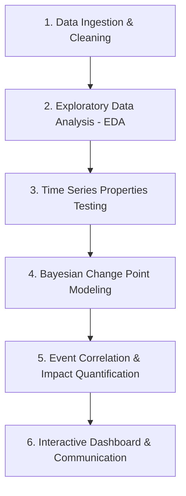

# Laying the Foundation for Analysis: Brent Oil Prices

**Birhan Energies Strategic Consultancy Report**  
*Author: Data Science Team, Birhan Energies*  
*Date: July 11, 2026*

---

## 1. Data Analysis Workflow Outline

To deliver robust, data-driven insights to investors, policymakers, and energy companies, we define a structured six-step workflow:

1. **Data Ingestion & Cleaning**:
   - Load raw Brent Crude oil prices and parse dates handles mixed formats.
   - Load and align historical events data (`events.csv`).
2. **Exploratory Data Analysis (EDA)**:
   - Visualize long-term price trends and major historical phases.
   - Calculate and visualize log returns to highlight price shocks and volatility clustering.
3. **Time Series Properties Testing**:
   - Assess trend components using rolling averages (e.g., 30-day and 365-day).
   - Test stationarity on raw prices and log returns using the Augmented Dickey-Fuller (ADF) test.
4. **Bayesian Change Point Modeling**:
   - Formulate a Bayesian model in PyMC to locate structural breaks (switch point $\tau$) and shift in mean prices ($\mu_1, \mu_2$).
   - Run Markov Chain Monte Carlo (MCMC) sampling and verify convergence.
5. **Event Correlation & Impact Quantification**:
   - Align detected change points with major geopolitical, economic, or policy events.
   - Conduct probabilistic comparisons of prices before and after the estimated switch point.
6. **Insight Generation & Dashboard Deployment**:
   - Deploy a Flask API backend and a responsive React frontend to serve and visualize the findings dynamically.

---

## 2. Structured Historical Event Dataset

We compiled 15 key events spanning from 1990 to 2022 across geopolitical, economic, and policy categories. These events serve as potential drivers for the detected change points:

| Date | Event | Category | Brief Description |
| :--- | :--- | :--- | :--- |
| **1990-08-02** | Iraq invades Kuwait | Geopolitical Conflict | Gulf War begins, disrupting Kuwaiti and Iraqi oil supply, causing a sharp price spike. |
| **1997-07-02** | Asian Financial Crisis | Economic Shock | Currency collapse across Asia sharply reduces oil demand, prices fall through 1998. |
| **1999-03-23** | OPEC Production Cuts | OPEC Policy | OPEC agrees in Vienna to cut production by 1.716 million bpd, helping prices recover. |
| **2001-09-11** | September 11 Attacks | Geopolitical Conflict | Market uncertainty and demand shock following US terrorist attacks. |
| **2003-03-20** | US Invasion of Iraq | Geopolitical Conflict | War disrupts Iraqi oil production and heightens Middle East risk premium. |
| **2008-07-11** | Peak Oil Price Pre-Crisis | Economic Shock | Brent hits record high (~$147) driven by demand growth and speculation. |
| **2008-09-15** | Global Financial Crisis | Economic Shock | Financial crisis triggers demand collapse, prices crash from highs. |
| **2011-02-15** | Arab Spring / Libyan Civil War | Geopolitical Conflict | Libyan oil production disrupted, supply-side price spike. |
| **2014-11-27** | OPEC Refuses to Cut Production | OPEC Policy | OPEC maintains output despite oversupply, triggering sharp 2014-16 price collapse. |
| **2016-11-30** | OPEC+ Production Cut Agreement | OPEC Policy | OPEC and non-OPEC producers agree to first coordinated cut since 2008, prices stabilize. |
| **2018-05-08** | US Withdraws from Iran Deal | Sanctions | Renewed US sanctions on Iranian oil exports tighten supply. |
| **2020-03-08** | Saudi-Russia Price War | OPEC Policy | OPEC+ talks collapse, Saudi Arabia floods market, prices crash further. |
| **2020-04-20** | COVID-19 Demand Collapse | Economic Shock | Global lockdowns collapse demand; WTI goes negative, Brent hits multi-year low. |
| **2022-02-24** | Russia Invades Ukraine | Geopolitical Conflict | War triggers sanctions on Russian oil, supply fears drive Brent above $120. |
| **2022-06-01** | EU Bans Russian Oil Imports | Sanctions | EU sanctions on Russian crude imports tighten global supply chains. |

---

## 3. Assumptions and Limitations

### Key Analysis Assumptions:
1. **Market Efficiency**: We assume Brent oil prices incorporate all publicly available market information (geopolitical risks, inventory levels, macroeconomic indicators) rapidly.
2. **Structural Stability between Breaks**: We assume that between change points, the underlying generative process of the time series remains relatively stable (e.g., constant mean or return properties).

### Statistical Correlation vs. Causal Impact:
> [!WARNING]
> **Correlation in Time is Not Causation**: Identifying a statistical change point that aligns with a specific historical event (e.g., a policy announcement) shows a **temporal correlation**, but it does not mathematically *prove* a causal impact.
> - **Confounding Variables**: Other factors, such as inflation, dollar strength, interest rates, and inventory shifts, may simultaneously drive prices.
> - **Lagged and Anticipatory Effects**: Markets often price in events *before* they occur (anticipation) or take weeks to adjust (lagged response), complicating the exact timing of structural breaks.
> - **Causal Inference**: To prove causality, techniques like Synthetic Controls, Structural Vector Autoregressions (SVAR), or difference-in-differences are required, rather than purely identifying structural breaks.

---

## 4. Time Series Properties of Brent Oil Prices

We performed statistical tests on the Brent daily oil price dataset (9,011 records, 1987-05-20 to 2022-11-14) with the following key findings:

### A. Trend Analysis
Raw prices show a strong stochastic trend, rising from sub-\$20 levels in the late 1980s and 1990s, peaking near \$147 in 2008, collapsing during the 2008 GFC, and experiencing subsequent major regimes (high-price period of 2011-2014, low-price period of 2015-2019, and the COVID/Ukraine war fluctuations in 2020-2022). 

*Rolling averages (30-day and 365-day) show significant smoothing, highlighting that long-term movements are driven by structural supply-demand shifts rather than short-term noise.*

### B. Stationarity Testing (Augmented Dickey-Fuller Test)
We conducted ADF tests on both raw prices and log returns:

- **Raw Prices**:
  - **ADF Statistic**: `-1.9939` (p-value: `0.2893`)
  - **Critical Values**: 1% (`-3.4311`), 5% (`-2.8619`), 10% (`-2.5669`)
  - **Implication**: The p-value is well above 0.05. We fail to reject the null hypothesis of a unit root. **Raw prices are non-stationary.**
  
- **Log Returns**:
  - **ADF Statistic**: `-16.4271` (p-value: `0.0000`)
  - **Critical Values**: 1% (`-3.4311`), 5% (`-2.8619`), 10% (`-2.5669`)
  - **Implication**: The p-value is 0.0000. We reject the null hypothesis. **Log returns are highly stationary.**

### C. Volatility Patterns & Volatility Clustering
Log returns exhibit strong **volatility clustering**—periods of high returns (both positive and negative) tend to cluster together (e.g., during the 1990 Gulf War, 2008 GFC, 2014 OPEC crash, and 2020 COVID outbreak), separated by periods of relative calm.

### D. Implications for Modeling
- **Non-stationarity of Raw Prices** implies that standard time-series techniques like simple linear regression or ARMA are invalid for raw prices due to risk of spurious regressions.
- **Log returns** should be used for modeling stationary returns and volatility clustering.
- For **Change Point Detection** on raw prices, we must formulate a model that explicitly accounts for sudden shifts in the mean ($\mu$) or variance ($\sigma$), using discrete switch parameters ($\tau$) to partition the regimes.

---

## 5. Change Point Models: Purpose and Outputs

### Purpose
Change point models are designed to identify **structural breaks** in time series data—points where the underlying probability distribution of the data (such as its mean, variance, or trend slope) changes. 

In Brent oil prices, change point models help split the 35-year timeline into distinct economic regimes instead of treating it as a single homogeneous process.

### Expected Outputs
1. **Switch Point ($\tau$)**: The estimated date or time index of the break, represented as a posterior probability distribution.
2. **Regime Parameters**: Estmates of the parameters before and after the break (e.g., mean price $\mu_1$ and $\mu_2$, standard deviations $\sigma_1$ and $\sigma_2$).
3. **Credibility Intervals**: Probabilistic boundaries (e.g., 95% High Density Intervals) indicating the certainty of the change point date and parameter values.

### Limitations of Change Point Models
- **Single-Point Simplification**: A single switch-point model assumes only one break occurs in the entire window. If applied to a long time series, it will find the single *most dominant* break, potentially ignoring other significant historical shifts.
- **Abrupt vs. Gradual Transitions**: The model assumes an instantaneous shift on day $\tau$. In reality, market adjustments (e.g., after the 2008 crash) may be gradual transitions rather than abrupt steps.

---

## 6. Communication Channels & Stakeholder Formats

To ensure actionable intelligence reaches our diverse stakeholders, we will deliver findings via three formats:

1. **Strategic Reports (Government/Policymaker Focus)**:
   - High-level executive summaries emphasizing energy security, macroeconomic impacts of oil shocks, and policy recommendations.
2. **Interactive Visual Dashboard (Investors & Analysts Focus)**:
   - Clean UI enabling user-driven date filtering, event highlighting, and visual inspection of rolling volatility and change points.
3. **Analytical Blog Post / Publication (Public & Corporate Stakeholder Focus)**:
   - Data storytelling narrative explaining how major world events directly shape global energy pricing structures.
